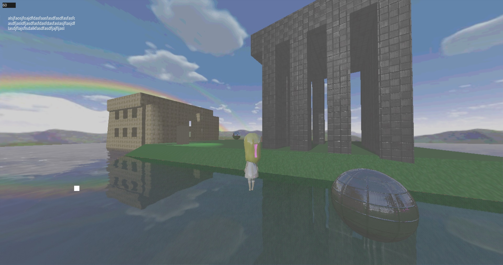

[한국어](README_kr.md)

# Little Ruler

* My own game engine project. Code once, build for both Windows and Android.
* Relavant game engine source codes are in `{repo_root}/engine`.

 

# Developer

* Sungmin Woo, An University Sturent
* woos8899@gmail.com

 

# Folders in Repo Root

### engine

* All the C++ codes for game are here.

### extern

* Git submodules are here.
* You shouldn't touch anything inside it.

### externtool

* Some submodules does not include CMakeLists.txt so I make ones myself.
* Those CMakeLists.txt are here.

### LittleRulerAndroid

* Android Studio project to build apk to run on Android platform.
* It contains some java codes to define some Android views.
* It uses C++ codes in `{repo_root}/engine` via CMake.

### Resource

* Resource files such as 3D models, images, texts, fonts are here.

 

# Control

### Windows

* WASD : Horizontal movement
* Keyboard arrows : View direction
* Mouse click AND drag (not OR) : Same as touch control on phones, which controls view direction.

### Android

* White point on lower left side of the screen : D-Pad
* Rest of the screen : View direction

 

# How to Build

* Clone this repo with `--recurse-submodules` option like below.
* `git clone --recurse-submodules -j8 https://github.com/SausageTaste/Little-Ruler`

### Android

* Open `{repo_root}/LittleRulerAndroid` folder on Android Studio and just click build.

### Windows

* Build `{repo_root}/engine/LittleRulerWindows/CMakeLists.txt` with CMake.
* I only tested on Visual Studio 2019 and mingw-w64 8.1.0.
* I don't know why but you need to do `Build Solution (F7)` several times or see error message saying "zlibstatic is not found".

 

# Implementation

## By Platforms

<table>
    <tr>
        <td></td>
        <td>Windows</td>
        <td>Android</td>
    </tr>
    <tr>
        <td>Render</td>
        <td>OpenGL 3.0</td>
        <td>OpenGL ES 3.0</td>
    </tr>
    <tr>
        <td>Window Creation</td>
        <td>GLFW</td>
        <td>Java GLSurfaceView</td>
    </tr>
    <tr>
        <td>Filesystem</td>
        <td>Windows API</td>
        <td>Android Asset Manager and std::fstream</td>
    </tr>
</table>

 

# Related Projects

* [Dalbaragi Model (DMD) Exporter for Blender](https://github.com/SausageTaste/io_scene_dalbaragi)
