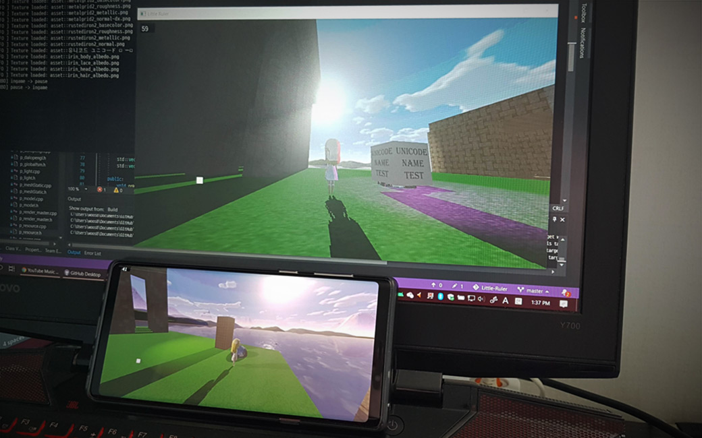

# Little Ruler

* 혼자서 진행하고 있는 게임 엔진입니다. 한 번의 코딩으로 안드로이드와 윈도우 모두에서 사용 가능한 엔진을 목표로 하고 있습니다.
* 사용 언어는 C++이며, 안드로이드에서는 JNI 인터페이스를 이용한 NDK를 사용합니다.
* 독자적인 레벨 에디터, 루아 스크립팅 등을 지원할 예정입니다.
* 엔진 소스코드는 모두 `{repo_root}/LittleRulerAndroid/app/src/main/cpp/` 안에 있습니다.

 

# 제작자

* 우성민, 대학생
* woos8899@gmail.com

 

# 내용물 설명

### LittleRulerAndroid 폴더

* 안드로이드 apk로 빌드 하기 위한 안드로이드 스튜디오 프로젝트입니다.
* 제가 작성한 게임 엔진 코드들은 모두 다음 경로에 들어 있습니다. `{repo_root}/LittleRulerAndroid/app/src/main/cpp/`

### LittleRulerWindows 폴더

* 윈도우즈 exe로 빌드 하기 위한 비주얼스튜디오 2019 프로젝트입니다.
* 프로젝트 구성 파일 외에는 없습니다. 소스는 안드로이드 프로젝트에 있는 파일을 참조하여 사용합니다.

### Resource 폴더

* 모델, 이미지, 텍스트, 폰트 등 모든 종류의 리소스들은 여기에 넣습니다.

 

# 빌드된 프로그램 실행 방법

* [구글 드라이브](https://drive.google.com/open?id=1xwQg17bW5f346rpXe2RFgifUFEycAm3t)에서 Windows용 exe와 Android용 apk를 다운로드할 수 있습니다.
* 자주 업데이트 하지는 않습니다. 빌드된 프로그램이 너무 오래됐다 싶으면 직접 빌드하거나 제게 메일을 보내 주세요.

### Windows

* `{google_drive}/Windows Built/` 폴더 속에 있는 여러 버전 중 하나를 골라 다운로드하여 실행해 주시면 됩니다.
* 실행시 DLL 파일이 없다는 에러가 뜬다면, 같은 폴더에 있는 `vc_redist.x86.exe`를 설치해 주세요. 마이크로소프트의 재배포 가능(Redistributable) 패키지입니다.
* x86으로 빌드된 바이너리만 제공합니다. x64는 직접 빌드하셔야 하며, 64비트용 VC++ 재배포 가능 패키지 또한 직접 구하셔야 합니다.

### Android

* 구글 드라이브의 `{google_drive}/Android Built/` 폴더 안에 있는 apk 중 하나를 골라 설치하시면 됩니다.
* 구글의 심사를 받지 않았습니다. 따라서 Google Play Protect가 꺼져 있어야 설치 가능합니다. [참고](https://stackoverflow.com/questions/51080755/installation-app-blocked-by-play-protect)

 

# 조작 방법

### Windows

* WASD : 수평 이동
* 방향키 : 시점 조작
* 마우스 클릭 및 드래그 : 안드로이드의 터치 조작과 동일
* 화면상에 루아 코드를 실행할 수 있는 창이 있습니다. 창에서 한줄 입력창처럼 생긴 것을 마우스로 클릭하면 글자 입력이 가능합니다.

### Android

* 화면 좌측 하단의 하얀 점 주변 : 방향 패드를 이용한 이동
* 나머지 빈 공간 : 시야 조작

 

# 빌드 방법

아래 외부 라이브러리에 적혀 있는 모든 라이브러리에 대한 링킹 설정을 직접 해주셔야 합니다. 새로운 컴퓨터에서 쉽게 빌드 할 수 있게 해주는 방법을 모릅니다. 좋은 공부 자료가 있으면 추천해 주세요. ㅜㅜ

 

# 외부 라이브러리

### C++ 17

* [Open Asset Import Lib (Assimp)](http://www.assimp.org/)
* [FreeType](https://www.freetype.org/)
* [The OpenGL Extension Wrangler Library (GLEW)](http://glew.sourceforge.net/)
* [OpenGL Mathematics (GLM)](https://glm.g-truc.net/)
* [LodePNG](https://lodev.org/lodepng/)
* [Lua](https://www.lua.org/)
* [Simple DirectMedia Layer 2 (SDL2)](https://www.libsdl.org/)
* [TGA](https://github.com/ColumbusUtrigas/TGA)
* [zlib](https://www.zlib.net/)
* [fmt](http://fmtlib.net/latest/index.html)
* [entt](https://github.com/skypjack/entt)

### Python 3.6.8

* [NumPy](https://www.numpy.org/)
* [PyGLM](https://pypi.org/project/PyGLM/)

 

# 구현

## 플랫폼별 구현

<table>
    <tr>
        <td></td>
        <td>Windows</td>
        <td>Android</td>
    </tr>
    <tr>
        <td>렌더링</td>
        <td>OpenGL 3.3</td>
        <td>OpenGL ES 3.0</td>
    </tr>
    <tr>
        <td>윈도우 생성</td>
        <td>SDL2</td>
        <td>Java GLSurfaceView</td>
    </tr>
    <tr>
        <td>파일 읽기</td>
        <td>C++ std::fstream</td>
        <td>Android Asset Manager 및 std::fstream</td>
    </tr>
</table>

 

# 관련 프로젝트

* [Dalbaragi Model (DMD) Exporter for Blender](https://github.com/SausageTaste/io_scene_dalbaragi)
* [Dalbaragi Python Utils](https://github.com/SausageTaste/Dalbaragi-Utils)
