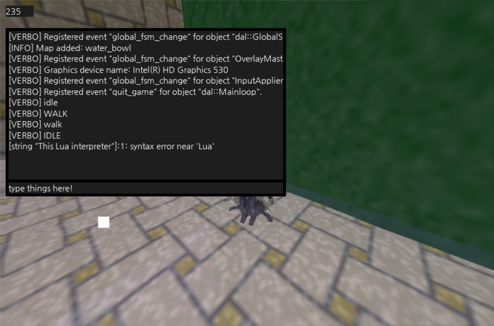

# Little Ruler

* 혼자서 진행하고 있는 게임 엔진입니다. 한 번의 코딩으로 안드로이드와 윈도우 모두에서 사용 가능한 엔진을 목표로 하고 있습니다.
* 사용 언어는 C++이며, 안드로이드에서는 JNI 인터페이스를 이용한 NDK를 사용합니다.
* 독자적인 레벨 에디터, 루아 스크립팅 등을 지원할 예정입니다.

 

# 제작자

* 우성민, 대학생
* woos8899@gmail.com

 

# 내용물 설명

### DalbaragiUtils 폴더

* 맵 에디터 및 맵 컴파일러 등 게임 플레이에는 필요없지만 제작에 유용한 도구들은 제 입문 언어인 파이썬으로 구현합니다.

### LittleRulerAndroid 폴더

* 안드로이드 apk로 빌드 하기 위한 안드로이드 스튜디오 프로젝트입니다.
* 모든 소스 파일들은 이곳에 들어 있습니다.

### LittleRulerWindows 폴더

* 윈도우즈 exe로 빌드 하기 위한 비주얼스튜디오 2019 프로젝트입니다.
* 프로젝트 구성 파일 외에는 없습니다. 소스는 안드로이드 프로젝트에 있는 파일을 참조하여 사용합니다.

### Library 폴더

* 빌드를 위해 필요한 C/C++ 헤더, 정적/동적 라이브러리 파일들이 들어있습니다.
* a/so는 안드로이드용이고 lib/dll은 윈도우용이며, include 헤더 파일들은 공용입니다.
* 용량이 너무 커서 깃 저장소에 포함하기 힘들어서 따로 압축파일 형태로 제공합니다. 다운로드 링크는 이후 나오는 *빌드 방법*에서 확인하세요.

 

# 빌드된 프로그램 실행 방법

* [구글 드라이브](https://drive.google.com/open?id=1xwQg17bW5f346rpXe2RFgifUFEycAm3t)에서 Windows용 exe와 Android용 apk를 다운로드할 수 있습니다.
* 자주 업데이트 하지는 않습니다. 빌드된 프로그램이 너무 오래됐다 싶으면 직접 빌드하거나 제게 메일을 보내 주세요.

### Windows

* `LittleRulerEXE.zip`을 다운로드하여 실행해 주시면 됩니다.
* 실행시 DLL 파일이 없다는 에러가 뜬다면, 구글 드라이브에 있는 `vc_redist.x86.exe`를 설치해 주세요. 마이크로소프트의 Redistributable입니다.

### Android

* 구글 드라이브에서 `Little-Ruler.apk`를 다운로드하여 설치하시면 됩니다.
* 구글의 심사를 받지 않았기 때문에 Google Play Protect가 꺼져 있어야 설치 가능합니다. [참고](https://stackoverflow.com/questions/51080755/installation-app-blocked-by-play-protect)

 

# 조작 방법

### Windows

* WASD : 수평 이동
* 스페이스바 : 수직 상승
* 좌측 쉬프트 : 수직 하강
* 마우스 클릭 및 드래그 : 안드로이드의 터치 조작과 동일
* ESC : 메뉴 열기/닫기
* 메뉴를 연 상태에서 `print("Hello world!")`가 적혀 있는 상자를 클릭하면 아스키 문자를 입력할 수 있습니다. 문자를 입력하고 엔터를 누르면 해당 문자를 Lua 인터프리터로 실행합니다. 결과는 우측 검은 상자에 나타납니다.

### Android

* 화면 좌측 : 방향 패드를 이용한 이동
* 화면 우측 : 시야 조작

 

# 빌드 방법

> 아직 제대로 테스트 해보지 않았습니다. 제대로 작동하지 않을 수 있습니다.

* 깃 저장소를 체크아웃 하거나 다운로드해 주세요.
* [구글 드라이브](https://drive.google.com/open?id=1xwQg17bW5f346rpXe2RFgifUFEycAm3t)에서 *Resource.zip*, *Library.zip* 두 파일을 다운로드하여 압축을 풀어 주세요. (암호 : moonlight)
* 압축 해제한 *Resource* 폴더와 *Library* 폴더를 깃 저장소 폴더에 넣어 주세요. 이때 폴더 구조는 다음과 같아야 합니다.

> ─ LittleRuler *(깃 저장소 루트 폴더)*
>  　└ **Library**
>  　　└ assimp-3.3.1
>  　　└ ...
>  　└ LittleRulerAndroid
>  　└ LittleRulerWindows
>  　└ **Resource**
>  　　└ asset
>  　　　└ font
>  　　　└ ...
>  　└ README.md
>  　└ ...

### Windows
* 윈도우용 exe를 빌드하기 위해서는 `LittleRuler/LittleRulerWindows/LittleRulerWindows.sln` 파일을 **Visual Studio 2019**로 열어서 빌드 하시면 됩니다.
* VS 2019가 아닌 이전 버전에서도 되는지는 잘 모르겠습니다.

### Android
* 안드로이드 장치를 이용해 디버깅 apk를 설치하려면 **Android Studio**로 `LittleRuler/LittleRulerAndroid` 프로젝트 폴더를 열어서 실행하시면 됩니다.
* 서명이 안 되어 있기 때문에 apk 파일을 직접 설치할 수는 없는 것 같습니다. ADB(Android Debug Bridge)로 설치해 주세요.
* 2019년 5월 2일부로 개발자 등록 완료하였습니다. [이곳](https://drive.google.com/open?id=1xwQg17bW5f346rpXe2RFgifUFEycAm3t)에서 apk를 다운로드 할 수 있습니다.

 

# 구현

## 플랫폼별 구현

<table>
    <tr>
        <td></td>
        <td>Windows</td>
        <td>Android</td>
    </tr>
    <tr>
        <td>렌더링</td>
        <td>OpenGL 3.3</td>
        <td>OpenGL ES 3.0</td>
    </tr>
    <tr>
        <td>윈도우 생성</td>
        <td>SDL2</td>
        <td>Java GLSurfaceView</td>
    </tr>
    <tr>
        <td>파일 읽기</td>
        <td>C++ std::fstream</td>
        <td>Android Asset Manager</td>
    </tr>
</table>

 

# 외부 라이브러리

### C++ 14

* [Open Asset Import Lib (Assimp)](http://www.assimp.org/)
* [FreeType](https://www.freetype.org/)
* [The OpenGL Extension Wrangler Library (GLEW)](http://glew.sourceforge.net/)
* [OpenGL Mathematics (GLM)](https://glm.g-truc.net/)
* [LodePNG](https://lodev.org/lodepng/)
* [Lua](https://www.lua.org/)
* [Simple DirectMedia Layer 2 (SDL2)](https://www.libsdl.org/)
* [TGA](https://github.com/ColumbusUtrigas/TGA)
* [zlib](https://www.zlib.net/)
* [fmt](http://fmtlib.net/latest/index.html)

### Python 3.6.8

* [NumPy](https://www.numpy.org/)
* [PyGLM](https://pypi.org/project/PyGLM/)